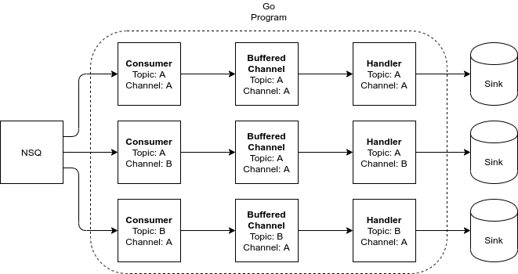

# NSQ

Wrapper of nsqio library

Please note that this library only wrapped the existing consumers from `nsq/nsqio` backend and mapped them. The `nsq.Handler` also overrided with `HandlerFunc` in this library.

## Design

The library flow control is based on buffered channel for each `topic` and `channel`. This means every consumer for different `topic` and `channel` might has different size of buffered channel and number of concurrency.

The worker model will replace `ConcurrenHandler` for handling multiple message concurrently. This is because the library want to control the flow of the message by using buffered channel as the main communication channel for worker.

### Throttling 

By design, the `handler` that registered by this library is not directly exposed to the `consumer handler`. This means the `handler` not directly asking for message from `nsq`.

The message is being sent into the `handler` from a go channel that is dedicated for specific `topic` and `channel`, and the message can be consumed from that go channel only. By using this mechanism, the rate of message consumed by the `concurrent handler` can be controlled when something wrong happened.

**Message Retrieval Throttling**

This throttling is on by default.

The message retrieval is throttled when the number of message in the `channel` is more than half of its size.

For example, if the length of buffer is 10, and the message already exceeding 5. The consumer will pause the message consumption until the number of message in the buffer is going back to less than half of the buffer.

**Message Processing Throttling**

This throttling can be enabled by using `Throttling` middleware

The message processing is throttled when the number of message in the `channel` is mor ethan half of its size.

For example if the length of buffer is 10, and the message already exceeding 5. The consumer will slow down the message processing, this throttling is being handled by the `Throttling` middleware in this library. If the throttle middleware is set, then the library will seek `throttled` status in the message.

## How To Use The Library

To use this library, the `consumer` must be created using `nsq/nsqio`.

## TODO

- DNS: make it possible to specify a single addresss with host or single/multiple address with IP. If a single host is given, then resolve to host.